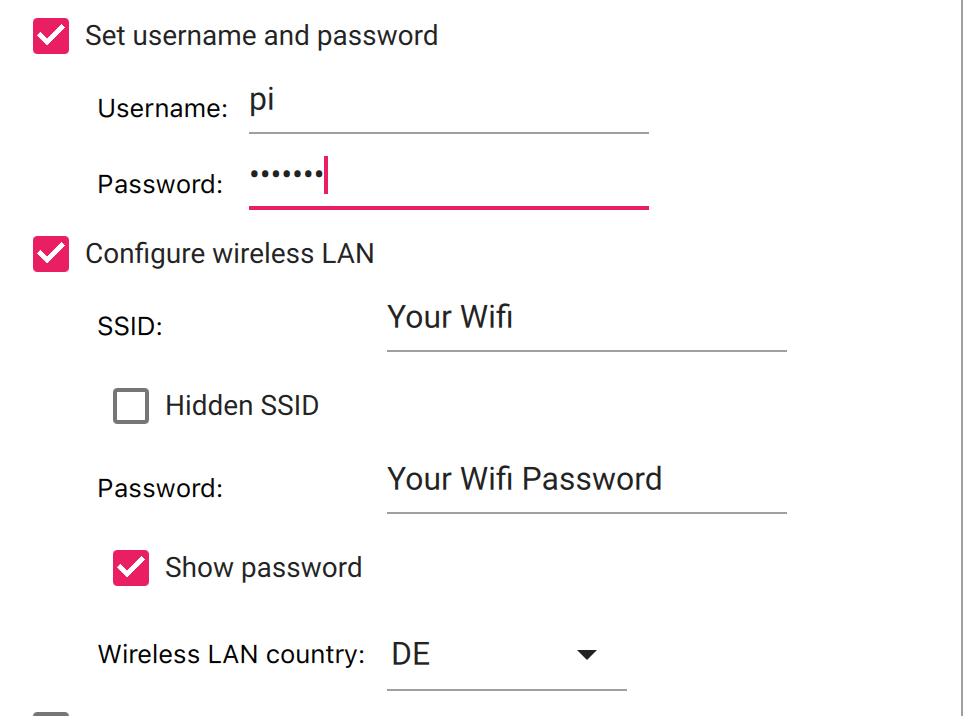

# Connect your analog turntable over wifi with Sonos using a Raspberry Pi Zero and a Soundcard
Thanks to replayreb for the [base tutorial](https://www.instructables.com/Add-Aux-to-Sonos-Using-Raspberry-Pi/) for this one. I created this repo to account for the issues I had following the instructions and setting everything up over ssh. 

## Necessary Hardware
### Soundcard
For the USB Soundcard I use a Behringer UFO202 U-Phono USB Audio Interface, which can be purchased on Amazon in Germany with this [link](https://www.amazon.de/-/en/gp/product/B07QGM13RX/ref=ppx_yo_dt_b_search_asin_title?ie=UTF8&psc=1)

### Raspberry Pi Zero
You will need a [Raspberry Pi Zero](https://www.raspberrypi.com/products/raspberry-pi-zero/) and a few extras:
- Case (for protection)
- Power Cable
- Micro SD Card
- Adapter to plug Micro SD Card into a second PC 
- USB to Micro USB Adapter (for the Soundcard)

## Base Setup of the Raspberry Pi
1. Download the Raspberry Pi Imager
2. Plug in your SD Card
3. Choose the default OS
    
4. Add the following settings with the settings button on the bottom right in the Imager App. Its important that the username is pi, choose passwords as you want
    
    

5. Choose your SD Card
6. Apply the image and wait

## Build
1. Connect your turntable with the soundcard input
2. Connect the Soundcard with one USB of the Raspberry Pi
3. Connect the power to the second USB of the Raspberry Pi
4. Give the Raspberry Pi a minute to boot.

## SSH into Raspberry Pi and Static IP
1. Open a terminal window and ssh into your raspberrypi. You can find your IP by running a ping 
    ```
    ping raspberrypi.local
    ```
2. Connect with ssh
    ```
    ssh pi@your_ip_goes_here
    ```
3. Once you have your IP make sure to assign it as a static IP to your Raspberry Pi within your Router Settings. This prevents the address of your stream to change if the router reboots / reassigns IPs

## Check the name of your Soundcard within Raspberry Pi
1. Check what number your Raspberry Pi assigned to the Soundcard
    ```
    arecord -l
    ```
2. In the output of this command the number next to the word "card" is the number of your soundcard
3. The name of your card based on this number is
    ```
    plughw:your_number,0
    ```
    So for example:
    ```
    plughw:1,0
    ```

## Install dependancies
1. Run these commands
    ```
    wget https://github.com/x20mar/darkice-with-mp3-for-raspberry-pi/blob/master/darkice_1.0.1-999~mp3+1_armhf.deb?raw=true

    mv darkice_1.0.1-999~mp3+1_armhf.deb?raw=true darkice_1.0.1-999~mp3+1_armhf.deb

    sudo apt-get install libmp3lame0 libtwolame0

    sudo dpkg -i darkice_1.0.1-999~mp3+1_armhf.deb
    ```
2. Then run this commands
    ```
    sudo apt-get install icecast2
    ```
    This will ask you for a few settings, you can leave everything as default and just click through by always saying "yes" or "ok"

## Setup Configuration of the Radio Server
1. Navigate to `/home/pi` (you are probably already there)
2. Create the config file (important to use sudo on these)
    ```
    sudo nano darkice.cfg
    ```

3. Paste the config and change the device. The only line you need to touch here is the device. Put in the soundcard name we found above.
    ```
    [general]
    duration        = 0      # duration in s, 0 forever
    bufferSecs      = 1      # buffer, in seconds
    reconnect       = yes    # reconnect if disconnected

    [input]
    device          = plughw:1,0 # Soundcard device for the audio input
    sampleRate      = 44100   # sample rate 11025, 22050 or 44100
    bitsPerSample   = 16      # bits
    channel         = 2       # 2 = stereo

    [icecast2-0]
    bitrateMode     = cbr       # ('cbr' constant, 'abr' average)
    #quality         = 1.0      # 1.0 is best quality (use only with vbr)
    format          = mp3       # format. Choose 'vorbis' for OGG Vorbis
    bitrate         = 320       # bitrate
    server          = localhost # or IP
    port            = 8000      # port for IceCast2 access
    password        = hackme    # source password for the IceCast2 server
    mountPoint      = rapi.mp3  # mount point on the IceCast2 server .mp3 or .ogg
    name            = Raspberry Pi
    ```
    Close editor with `ctrl + x` and `enter`
4. Create shell script
    ```
    sudo nano darkice.sh
    ```
5. Copy this content and close again
    ```
    #!/bin/bash
    sudo /usr/bin/darkice -c /home/pi/darkice.cfg
    ```

6. Make the shell script executable
    ```
    sudo chmod 777 /home/pi/darkice.sh
    ```

7. Start the service
    ```
    sudo service icecast2 start
    ```

## Setup Cronjob that starts the service every time the Raspberry Pi starts
1. Open Crontab
    ```
    crontab -e
    ```
2. Navigate to the bottom of the file and add (on a new line)
    ```
    @reboot sleep 30 && sudo /home/pi/darkice.sh
    ``` 

## Reboot by disconnecting Raspberry Pi from Power

## Test
1. Navigate with a browser to `http://your_ip_goes_here:8000`
2. If you just have a black page including this content, than you are golden:
    
3. If it looks different or you doesnt start at all, bad luck
4. Check your stream here under `http://your_ip_goes_here:8000/rapi.mp3`
5. If you play something on your turntables it will be streamed under this address

## Add to Sonos:
1. Add TuneIn as a Service 
2. Add a custom radio station pasting `http://your_ip_goes_here:8000/rapi.mp3` in the url and a custom name
3. Add the custom station to My Sonos so you never have to use the TuneIn Tab


